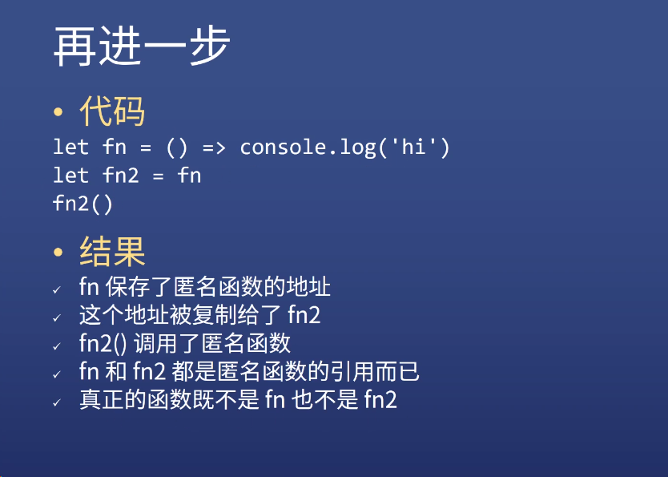
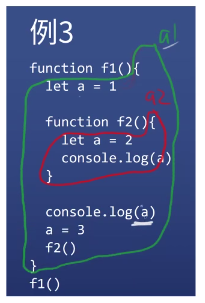
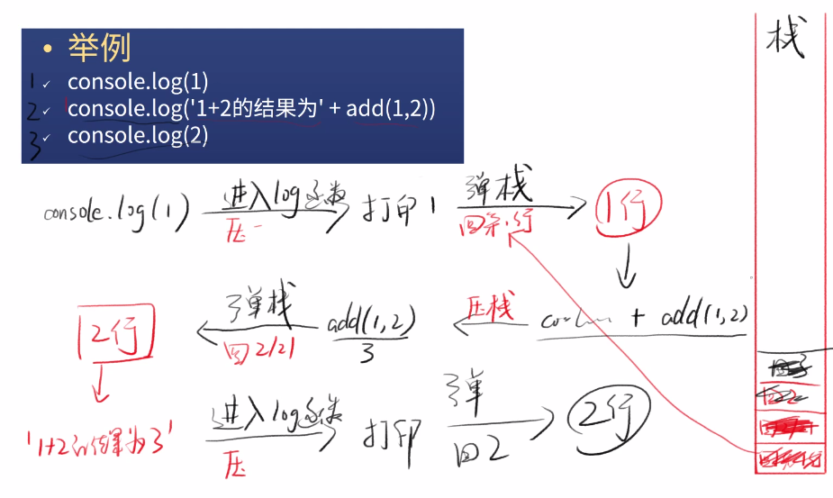
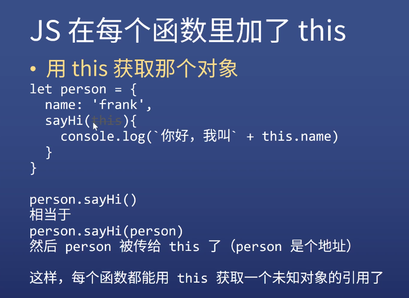

# JS 函数

- JS 函数是对象

## 一、定义一个函数

1. 具名函数

```javascript
function 函数名 (形参1， 形参2){
    语句
    return 返回值
}
```

2. 匿名函数  
   等号右边叫**函数表达式**

```javascript
let a = function (x, y) {
  语句;
  return 返回值;
};
```

3. 特殊情况

```javascript
let a = function fn(x, y) {
  return x + y;
};
fn(1, 2);
//会报错，=右边的fn只在=右边有效，全局调用没有fn，只能用a
```

4. 箭头函数

```javascript
let f1 = (x) => x * y;

let f2 = (x, y) => {
  console.log("hi");
  return x * y;
};

let f3 = (x) => ({ name: "x" });
```

5. 构造函数
   - 基本没人用，但是能让你知道函数是谁构造的
   - 所有函数都是 Function 构造出来的
   - 包括 Object、Array、Function

```javascript
let f1 = new Function("x", "y", console.log('hi'); "return x + y");
```

6. 函数与函数调用

  
_图片来自杭州饥人谷教程_

- fn 与 fn()
- let fn2 = fn; fn2();

## 二、函数的要素

- 每个函数都有这些东西
  1. 调用时机
  2. 作用域
  3. 闭包
  4. 形式参数
  5. 返回值
  6. 调用栈
  7. 函数提升
  8. arguments（除了箭头函数）
  9. this（除了箭头函数）

### 1. 调用时机

- let 在 for 外面

```javascript
let i;
for (i = 0; i < 6; i++) {
  setTimeout(() => {
    console.log(i);
  }, 0);
}
//打印6个6
```

- let 在 for 里面

```javascript
for (let i = 0; i < 6; i++) {
  setTimeout(() => {
    console.log(i);
  }, 0);
}
//打印 0,1,2,3,4,5
```

    - 因为JS在for 和let一起用的时候会加东西
    - 每次循环会多创建一个i

### 2. 作用域

```javascript
function fn() {
  let a = 1;
}
console.log(a);
//报错 a 不存在，a为局部变量，只作用在fn里面
```

- 全局变量 局部变量

  1. 全局变量
     - 在顶级作用域声明的变量
     - window 的属性是全局变量
  2. 其他的都是局部变量

- 函数可嵌套

  ```javascript
  function f1() {
    let a = 1;
    function f2() {
      let a = 2;
      console.log(a);
    }
    console.log(a);
    a = 3;
    f2();
  }
  f1();
  ```

    
  _图片来自杭州饥人谷教程_  
  先确定是哪个 a，在确定在哪个作用域。

- 作用域规则
- 如果多个作用域有同名变量 a
  1. 那么查找 a 的声明时，就向上取最近的作用域
  2. 简称[就近原则]
  3. 查找 a 的过程与函数执行无关
  4. 但 a 的值与函数执行有关
- 如果作用域与函数执行无关，叫做静态作用域（也叫词法作用域）

### 3. 闭包

- 如果一个函数用到它作用域外的变量，那么这个函数加这个变量，就叫做闭包
- 下面 f2 里的 a 和 f3 组成了闭包

```javascript
function fi() {
  let a = 1;
  function f2() {
    let a = 2;
    function f3() {
      console.log(a);
    }
    a = 22;
    f3();
  }
  console.log(a);
  a = 100;
  f2();
}
f1();
```

### 4. 形式参数

- 形式参数的意思就是非实际参数
- 调用时传入的参数是实际参数（传入的是复制的地址）
- 形参的本质是变量声明
  ```javascript
  function add() {
    var x = arguments[0];
    var y = arguments[1];
    return x + y;
  }
  ```
- 形参可多可少，只是给参数取名字

### 5. 返回值

- 每个函数都有返回值
- 注意：console.log('hi') 的值是 undefined
- 函数执行完了才有返回值

### 6. 调用栈

- 什么是调用栈
  1. JS 引擎在调用一个函数前
  2. 需要把函数所在的环境 push 到一个数组里
  3. 这个数组叫做调用栈
  4. 等函数执行完了，就会把环境弹出来（pop）
  5. 然后 return 到之前的环境，继续执行后续代码
- 举例
    
  _图片来自杭州饥人谷教程_  

- 递归函数（如阶乘）
  ```javascript
  function fn(n) {
    return n === 1 ? 1 : n * fn(n - 1);
  }
  ```
- 递归的调用栈
  1. 递进 - 压栈 - 一只递进一直压栈，递一次压一次栈，一直累积
  2. 回归 - 弹栈 - 开始回归才开始弹栈
- 递归压栈的贞超过最大值就会爆栈，报错  
  调用栈最大值测试代码：
  ```javascript
  function computeMaxCallStackSize() {
    try {
      return 1 + computeMaxCallStackSize();
    } catch (e) {
      //报错说明 stack overflow 了
      return 1;
    }
  }
  ```
  Chrome 12578
  Firefox 26773
  Node 12536
  取决于浏览器 JS 引擎

### 7. 函数提升

- 函数提升
  1. function fn() {}
  2. 不管你把**具名函数**声明在哪里，他都会跑到第一行
- 不是函数提升
  1. let fn = function(){}
  2. 这是赋值，右边的匿名函数声明不会提升

### 8. arguments

- 每个函数都有，除了箭头函数

- argument 包含所有参数的伪数组，传参的同时会复制到 argument 里

### 9. this

- 每个函数都有，除了箭头函数
- 如果不给任何条件，this 默认指向 window
- 目前只能通过 call 来指定 this
- 如果传的 this 不是对象，JS 会自动帮你封装成对象  
  禁用此功能：在声明函数时加上字符串'use strict'

  ```javascript
  function fn() {
    "use strict";
    console.log(this);
  }
  ```

  但是，没有人会在定义函数的时候加上这句话。。

- call
  fn.call(xxx,2,3,4)  
  xxx（第一个），是 this  
  1，2，3（后面几个） 是 argument

- 假设没有 this

  - 我们可以用直接保存了对象地址的变量获取'name'
  - 我们把这种方法简称为引用
  - 代码示例

  ```javascript
  let person = {
    name: "frank",
    sayHi() {
      console.log("你好，我叫" + person.name);
    },
  };
  ```

  - 但是：
    - 如果 person 改名了，sayHi 函数就挂了
    - sayHi 函数甚至有可能在另一个文件里面
    - 所以我们不希望 sayHi 函数出现 person 引用

- 用 this 获取那个对象（person）

  ```javascript
  let person = {
    name: "frank",
    sayHi() {
      //sayHi(隐藏了this)
      console.log(`你好，我叫` + this.name);
    },
  };
  ```

  - person.sayHi() 相当于 person.sayHi(person)
  - person.sayHi() 会隐式的把 person 作为 this 传给 sayHi  
      
    _图片来自杭州饥人谷教程_  

- this 两种调用法

  1. 小白调用法  
     person.sayHi() 默认传 person
  2. 大师调用法  
     person.sayHi.call(person) 可以传别的 this  
     以后所有函数调用都用这种写法
     - 如果函数里没有 this，call(里面要多传第一个参数 undefined，用来占位)
     - 有 this，第一个参数传函数作用的东西（也就是 this 对应的），后面再传其他参数

- .call
  fn.call(xxx,2,3,4)  
  xxx（第一个），是 this  
  1，2，3（后面几个） 是 argument
- .apply
  fn.apply(xxx,[2,3,4])  
  除了 this 后面参数加中括号[]，其他的和 call 一样
- .bind

  1. 让 this 不被改变

  ```JavaScript
  function f1(p1, p2){
    console.log(this, p1, p2)
  }
  let f2 = f2.bind({name:'frank'})
  ```

  f2 就是 f1 绑定了 this 之后的新函数  
  f2() 等价于 f1.call({name: 'frank'})

  2. .bind 还可以绑定其他参数

  ```javascript
  let f3 = f1.bind({ name: "frank" }, "hi");
  ```

  f3() 等价于 f1.call({name: 'frank'}, 'hi')

### 10. 箭头函数

- 没有 argument 和 this
- 箭头函数里的 this 就是一个普通变量，相当于一个 a、b 之类的普通变量
  ```javascript
  console.log(this); //打印window
  let fn = () => console.log(this);
  fn(); //还是打印window
  ```
- 就算你加上 call 都没有用
  ```javascript
  fn.call({ name: "frank" }); //仍然打印window
  ```

### 11.立即执行函数

- 只有 JS 才有的变态玩意，现在很少用，一般用来声明局部变量

```javascript
!(function () {
  var a = 2;
  console.log(a);
})();
```

函数前面加+-!~都行，不加报错，最好用!，其他可能出 bug  
可以不加，也尽量不要加最外面的括号()，如果加()，上一句必须用;  
vscode 格式化了自动加了()

- 新版 JS，有新的方法声明局部变量

```javascript
{
  let a = 2;
  console.log(a);
}
```
